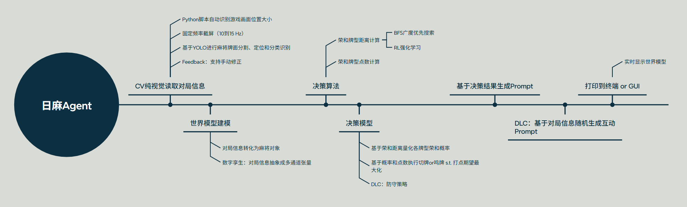

# 日麻小助手Agent 核心Workflow



# 项目架构

```
ri_mahjong_helper_agent/  # 项目根目录
├── README.md             # 项目说明文档（包含功能介绍、部署步骤、依赖说明等）
├── requirements.txt      # 项目依赖包列表（如yolov5/8、opencv-python、torch等）
├── config/               # 配置文件目录
│   ├── global_config.py  # 全局配置（截图频率、YOLO模型路径、LLM API密钥等）
│   ├── yolo_config.yaml  # YOLO模型配置（类别映射、置信度阈值等）
│   └── llm_prompt.py     # LLM Prompt模板配置
├── perception/           # 感知层（Perception）
│   ├── __init__.py
│   ├── cv_module/        # 计算机视觉模块（基于YOLO）
│   │   ├── __init__.py
│   │   ├── screen_capture.py  # 屏幕捕获（固定频率截图、画面位置识别）
│   │   ├── yolo_detector.py   # YOLO麻将牌识别（分割、定位、分类）
│   │   ├── manual_correction.py  # 手动修正模块（鼠标点击输入对局信息）
│   │   └── utils.py      # CV辅助工具（图像预处理、坐标转换等）
│   └── data_input.py     # 感知层数据整合（AI输出+人工输入统一封装）
├── world_model/          # 世界模型（World Model）
│   ├── __init__.py
│   ├── entities/         # 麻将核心对象定义
│   │   ├── __init__.py
│   │   ├── mahjong_table.py  # MahjongTable类
│   │   ├── player.py         # Player类
│   │   ├── hand.py           # Hand类（含暗手、副露子类）
│   │   └── mahjong_tile.py   # MahjongTile类
│   ├── game_frame.py     # 游戏帧生成（多通道张量转化）
│   └── status_manager.py # 对局状态管理（接收感知层数据，更新世界模型）
├── decision/             # 决策层（Decision）
│   ├── __init__.py
│   ├── point_calculator/ # 点数计算模块
│   │   ├── __init__.py
│   │   ├── fan_fu_calc.py    # 番数、符数计算
│   │   ├── point_calc.py     # 最终点数计算
│   │   └── state_machine.py  # 牌型状态机转移（清一色、九莲宝灯等）
│   ├── hand_strategy/    # 牌型推荐与操作指导
│   │   ├── __init__.py
│   │   ├── hand_recommend.py # top10荣和牌型及概率推荐
│   │   ├── probability_tree.py # 概率树与期望计算
│   │   └── operation_guide.py # 摸切/手切/鸣牌/胡牌策略（含防守策略）
│   └── strategy_optimize.py # 策略最优化（胡牌概率+打点期望权衡）
├── execution/            # 执行层（Execution）
│   ├── __init__.py
│   ├── llm_client/       # LLM API接入模块
│   │   ├── __init__.py
│   │   ├── base_llm.py   # LLM基础封装（统一调用接口）
│   │   └── openai_llm.py # 具体LLM实现（如OpenAI API，可扩展其他LLM）
│   └── prompt_engineering.py # Prompt工程（决策信息包装为个性化语句）
├── utils/                # 全局工具类
│   ├── __init__.py
│   ├── log_utils.py      # 日志工具
│   ├── data_utils.py     # 数据处理工具（张量操作、数据校验等）
│   └── ui_utils.py       # 简易UI工具（手动修正界面、信息展示界面）
├── models/               # 模型文件目录（存放YOLO权重、自定义模型等）
│   └── yolov8_mahjong.pt # YOLO麻将识别权重文件
├── img/                  # 图片目录（存放流程图、示例图片等）
│   └── img.png           # 小助手模块流程图
├── tests/                # 单元测试目录
│   ├── __init__.py
│   ├── test_perception.py
│   ├── test_world_model.py
│   ├── test_decision.py
│   └── test_execution.py
└── main.py               # 项目入口文件（整合各模块，启动日麻小助手）
```

## Perception感知层

### CV计算机视觉（基于YOLO）

输入需要自己在游戏界面捕获，
AI自动输出本家手牌信息（不包括副露），
人工输出其他全部对局信息（兼容置为null）

#### 纯视觉读取对局信息

#### Python脚本自动识别游戏画面位置大小

#### 固定频率截图（10到15 Hz）

#### 基于YOLO进行麻将牌面分割、定位和分类识别

#### 手动修正

识别率在85%左右，补充提供鼠标click部署世界模型（点击输入对局信息）
点击牌局模块后（如上家牌河区），出现所有牌（包括删除键）的界面，点击后就能输出牌河信息

### World Model世界模型

输入是status类信息，
输出是游戏帧

#### 麻将对象转化

```python
class MahjongTable:
    """"
    游戏桌类：
    管理场次类型（半庄战）、
    局次类型（南一局）、
    庄家信息（用户1）、
    手牌区与副露区、
    牌河区、
    牌山区、
    岭上区、
    宝牌区、
    玩家点数（25000点）、
    立直信息、
    校验全局信息（全局点数和守恒）
    """
    pass

    
class Player:
    """"
    玩家类：
    玩家信息、
    当前点数、
    是否庄家、
    是否立直、
    手牌与副露、
    切/吃/碰/杠/胡方法
    """
    pass
    
    
class Hand:
    """"
    手牌类：
    暗手子类、
    副露子类、
    存储、排序、查找、移除等方法
    """
    pass
    
    
class MahjongTile:
    """
    麻将牌类，用于表示一张麻将牌的属性和行为
    包含类型：万、条、筒（序数牌）；东、南、西、北（风牌）；中、发、白（箭牌）
    """
    pass
```

#### 多通道张量

将对局信息转化成一个多通道张量————游戏帧

1. 手牌（本家）len=34
2. 副露（本家、下家、对家、上家）
3. 牌河（时序）
4. 点数
5. 场风
6. 场次局次轮次


## Decision决策层

### 点数计算

实现输入荣和牌型，输出番数、符数、点数

#### 状态机转移

例子：
1. 手牌触发胡牌状态：传统型（雀头 + 4 * 刻子/顺子/杠子）、七对子、国士无双
2. 传统型 + 全是万/条/筒 转移为 清一色
3. 清一色 + 幺九刻子 + 一气通贯 转移为 九莲宝灯
4. 九莲宝灯 + 九面听 转移为 纯正九莲宝灯

### 牌型推荐

实现输入当前牌型（13张 or 14张），输出top10可能荣和的牌型以及其概率

#### 概率树 + 期望


### 摸切手切鸣牌指导

实现遇到切/鸣/胡事件时，给出策略（操作增加的胡牌概率和打点期望）

#### 策略最优化

#### 防守策略

## Execution执行层

### LLM API接入

本质是一个对话助手，给出策略，要有“人性”地说出来，表现出像一个真人在对玩家进行麻将指导、聊天和提醒玩家场上信息


### Prompt工程

将决策信息，包装成个性化语句输出