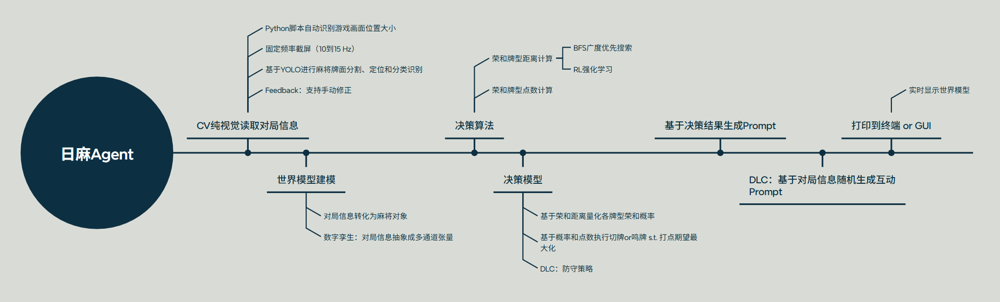

# 日麻小助手Agent 核心Workflow



# 项目架构

```
MahjongPaw/
├── main.py                    # 项目入口（启动 GUI）
├── api_gui.py                 # GUI 主界面（流式输出、聊天、Markdown 渲染）
├── analyzer.py                # 牌局分析器（向听数、听牌、打点计算）
├── api.py                     # 大模型 API 调用（DeepSeek）
├── cal_scores.py              # 点数计算模块
├── Mahjong_YOLO/              # YOLO 麻将牌识别模块
│   ├── trained_models_v2/     # 训练好的 YOLO 模型权重
│   │   ├── yolo11n_best.pt
│   │   ├── yolo11s_best.pt
│   │   └── yolo11m_best.pt
│   ├── notebooks/             # 数据标注和处理
├── world_model/               # 世界模型（麻将对象定义）
│   ├── mahjong_table.py       # 麻将桌类
│   ├── mahjong_player.py      # 玩家类
│   ├── mahjong_tile.py        # 麻将牌类
│   └── mahjong_meld.py        # 副露类
├── models/                    # 模型文件目录
│   └── yolov8_mahjong.pt      # YOLO 模型权重（备用）
├── requirements.txt           # 项目依赖
└── README.md                 # 项目说明文档
```

## Perception感知层

### CV计算机视觉（基于YOLO）

输入需要自己在游戏界面捕获，
AI自动输出本家手牌信息（不包括副露），
人工输出其他全部对局信息（兼容置为null）

#### 纯视觉读取对局信息

#### Python脚本自动识别游戏画面位置大小

#### 固定频率截图（10到15 Hz）

#### 基于YOLO进行麻将牌面分割、定位和分类识别

#### 手动修正

识别率在85%左右，补充提供鼠标click部署世界模型（点击输入对局信息）
点击牌局模块后（如上家牌河区），出现所有牌（包括删除键）的界面，点击后就能输出牌河信息

### World Model世界模型

输入是status类信息，
输出是游戏帧

#### 麻将对象转化

```python
class MahjongTable:
    """"
    游戏桌类：
    管理场次类型（半庄战）、
    局次类型（南一局）、
    庄家信息（用户1）、
    手牌区与副露区、
    牌河区、
    牌山区、
    岭上区、
    宝牌区、
    玩家点数（25000点）、
    立直信息、
    校验全局信息（全局点数和守恒）
    """
    pass

    
class Player:
    """"
    玩家类：
    玩家信息、
    当前点数、
    是否庄家、
    是否立直、
    手牌与副露、
    切/吃/碰/杠/胡方法
    """
    pass
    
    
class Hand:
    """"
    手牌类：
    暗手子类、
    副露子类、
    存储、排序、查找、移除等方法
    """
    pass
    
    
class MahjongTile:
    """
    麻将牌类，用于表示一张麻将牌的属性和行为
    包含类型：万、条、筒（序数牌）；东、南、西、北（风牌）；中、发、白（箭牌）
    """
    pass
```

#### 多通道张量

将对局信息转化成一个多通道张量————游戏帧

1. 手牌（本家）len=34
2. 副露（本家、下家、对家、上家）
3. 牌河（时序）
4. 点数
5. 场风
6. 场次局次轮次


## Decision决策层

### 点数计算

实现输入荣和牌型，输出番数、符数、点数

#### 状态机转移

例子：
1. 手牌触发胡牌状态：传统型（雀头 + 4 * 刻子/顺子/杠子）、七对子、国士无双
2. 传统型 + 全是万/条/筒 转移为 清一色
3. 清一色 + 幺九刻子 + 一气通贯 转移为 九莲宝灯
4. 九莲宝灯 + 九面听 转移为 纯正九莲宝灯

### 牌型推荐

实现输入当前牌型（13张 or 14张），输出top10可能荣和的牌型以及其概率

#### 概率树 + 期望


### 摸切手切鸣牌指导

实现遇到切/鸣/胡事件时，给出策略（操作增加的胡牌概率和打点期望）

#### 策略最优化

#### 防守策略

## Execution执行层

### LLM API接入

本质是一个对话助手，给出策略，要有“人性”地说出来，表现出像一个真人在对玩家进行麻将指导、聊天和提醒玩家场上信息


### Prompt工程

将决策信息，包装成个性化语句输出